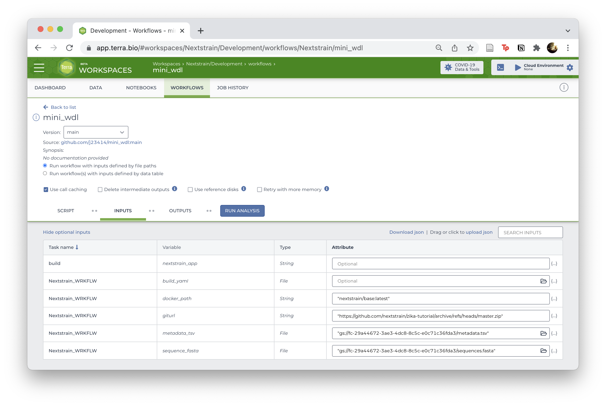

# A WDL Pathogen Build

1. Go to the `wdl_pathogen_build` workflow from [Dockstore](https://dockstore.org/workflows/github.com/j23414/wdl_pathogen_build)
2. Launch with "Terra" and add to your workspace
3. Link the relevant inputs and hit "Run Analysis"

* Either connect a `sequence.fasta` and `metadata.tsv` file pair
* Or connect a `build.yaml` where you can adjust sampling priorities or run multiple builds.



## Local Testing

The native install seems to require Java 11. On macOS, installed `cromwell` via Homebrew ([ONT Installing Dependencies](https://dockstore.org/workflows/github.com/aryeelab/nanopore_tools/combine_sample_sheets:dev?tab=info), [Cromwell's 5 minute tutorial](https://cromwell.readthedocs.io/en/stable/tutorials/FiveMinuteIntro/))

```
brew install cromwell
# Will also need to install and start Docker
```

Run the `ncov` tutorial:

```
cromwell run workflow.wdl \
  -i input_ncov.json \
  -o options.json \
  &> log.txt
```

Run the `zika` tutorial:

```
cromwell run workflow.wdl \
  -i input_zika.json \
  -o options.json \
  &> log.txt
```

The local results will look like

```
results/
  |_ wf_logs/
  |_ call_logs/
  |
  |_ auspice.zip
  |_ glob-XXXXX/*.json
```

The Terra results will look like

```
cromwell-executions/
|_ Nextstrain_WRKFLW/
  |_ 0712e720-bbd0-454b-ae4e-21337d0b98b7/
    |_ call-mk_buildconfig/
    |_ call-build/
      |_ inputs/
      |_ execution/
        |_ auspice/      #<= here
```

## Other Notes

<details><summary>Expand and view</summary>

**Repos:**

[nextstrain/ncov](https://github.com/nextstrain/ncov) | [zika-tutorial/wdl](https://github.com/nextstrain/zika-tutorial/tree/wdl) | [corneliusroemer/ncov-simplest](https://github.com/corneliusroemer/ncov-simplest) | [theiagen/public\_health\_viral\_genomics](https://github.com/theiagen/public_health_viral_genomics)

**Seems to already exist:**

* https://dockstore.org/search?descriptorType=WDL&entryType=workflows&search=nextstrain
* Terra Workspace: https://app.terra.bio/#workspaces/pathogen-genomic-surveillance/COVID-19_Broad_Viral_NGS

**References:**

* [WDL Best Practices](https://docs.dockstore.org/en/develop/advanced-topics/best-practices/wdl-best-practices.html)
* [broadinstitute/viral-pipelines/pipes](https://github.com/broadinstitute/viral-pipelines/tree/master/pipes)
* [Intro to Docker, WDL, CWL](https://bdcatalyst.gitbook.io/biodata-catalyst-documentation/written-documentation/getting-started/analyze-data-1/dockstore/intro-to-docker-wdl-cwl)

## Local testing

The native install seems to require Java 11 (didn't want to mess up my nextflow environment which requires Java 8, I think...). Therefore went the Homebrew route.

* [ONT Installing Dependencies](https://dockstore.org/workflows/github.com/aryeelab/nanopore_tools/combine_sample_sheets:dev?tab=info)

```
brew install cromwell
```

* https://cromwell.readthedocs.io/en/stable/tutorials/FiveMinuteIntro/

```
# Start docker deamon

# Terra workflow
cromwell run workflow.wdl \
  -i input_ncov.json \
  -o options.json \
  &> log.txt
```

A general purpose version in `flex.wdl`

```
# Option 1: one wrapped task
git clone https://github.com/nextstrain/zika-tutorial.git
cromwell run flex.wdl \
  -i flex_input_1.json \
  -o options.json \
  &> log.txt

# Option 2: separate tasks
cromwell run flex.wdl \
  -i flex_inputs_2.json \
  -o options.json \
  &> log.txt
```

Output:

```
# Option 1
ls -1tr results

|_ auspice/  #<= this one

# Option 2
ls -1tr results

|_ call-IndexSequences
|_ call-Filter
|_ call-Align
|_ call-Tree
|_ call-Refine
|_ call-Ancestral
|_ call-Traits
|_ call-Translate
|_ call-Export
    |_ zika.json        #<= this one!
```

## Debug Notes

Cromwell runs creates a `cromwell-execution` folder. (In comparison, Nextflow creates a `work` folder. I'm not sure if Snakemake creates a cache folder.) Haven't figured out how to reroute the cromwell output to a separate folder yet.

```
cromwell-executions/
  |_ Nextstrain_WRKFLW/
    |_ 6995bcdf-6c11-4a08-ab08-94bacc5796b2/
      |_ call-build/
        |_ tmp.760887c3
        |
        |_ inputs/
        | |_ -414136411/
        |   |_ zika-tutorial/
        |
        |_ execution/
          |_ script
          |_ script.background
          |_ script.submit
          |_ docker_cid
          |_ rc
          |
          |_ stdout    #<= check these files to debug
          |_ stderr    #<=
          |_ stdout.background
          |_ stderr.background
          |
          |_ results/  #<= output, must be in this folder, can't be in input folder or it will fail
          |_ auspice/
```

## Generating a build config

So apparently the HEREDOC will expand entire file path. Worked on Terra, which was a surprise.

```
inputs:
- name: example
  metadata: /cromwell-executions/Nextstrain_WRKFLW/18bf94cf-8eb3-4079-ab97-beec05296b01/call-mk_buildconfig/inputs/-613910572/metadata.tsv
  sequences: /cromwell-executions/Nextstrain_WRKFLW/18bf94cf-8eb3-4079-ab97-beec05296b01/call-mk_buildconfig/inputs/-613910572/sequences.fasta
- name: references
  metadata: data/references_metadata.tsv
  sequences: data/references_sequences.fasta
```

</details>
