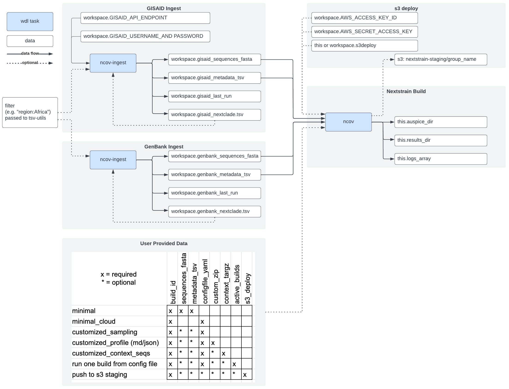

# A WDL Pathogen Build

## Overview of Pipeline

## Dockstore

* [j23414/wdl\_pathogen\_build/ncov:main](https://dockstore.org/workflows/github.com/j23414/wdl_pathogen_build/ncov:main?tab=info)
* [j23414/wdl\_pathogen\_build/genbank\_ingest:main](https://dockstore.org/workflows/github.com/j23414/wdl_pathogen_build/genbank_ingest:main?tab=info)
* [j23414/wdl\_pathogen\_build/gisaid\_ingest:main](https://dockstore.org/workflows/github.com/j23414/wdl_pathogen_build/gisaid_ingest:main?tab=info)

**Migrating to ncov**

* [nextstrain/ncov/ncov:master](https://dockstore.org/workflows/github.com/nextstrain/ncov/ncov:master?tab=info)
* [nextstrain/ncov/gisaid_ingest:master](https://dockstore.org/workflows/github.com/nextstrain/ncov/gisaid_ingest:master?tab=info)
* [nextstrain/ncov/genbank_ingest:master](https://dockstore.org/workflows/github.com/nextstrain/ncov/genbank_ingest:master?tab=info)

## Notes

* [openwdl grammar](https://github.com/openwdl/wdl/blob/main/versions/1.0/SPEC.md#global-grammar-rules)

## Testing

https://github.com/j23414/wdl_pathogen_build/blob/main/data/benchmarks.tsv#L1-L4